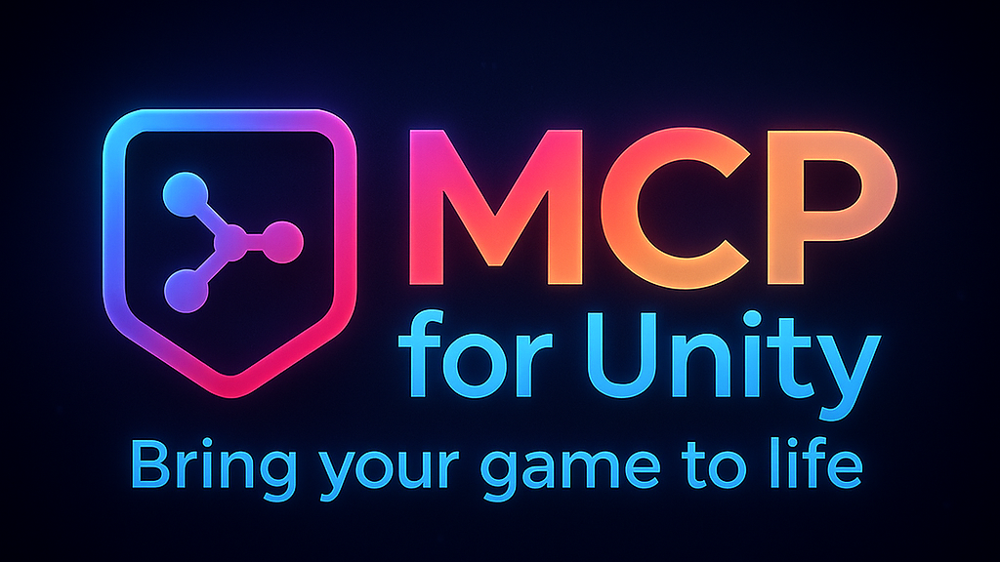

| [English](README.md) | [简体中文](docs/i18n/README-zh.md) |
|----------------------|---------------------------------|

#### Proudly sponsored and maintained by [Aura](https://www.tryaura.dev/) — the AI assistant for Unreal & Unity.
##### And don't miss [Godot AI](https://github.com/hi-godot/godot-ai), the new open source MCP/AI project from the makers of MCP for Unity.

[](https://coplaydev.github.io/unity-mcp/)
[](https://discord.gg/y4p8KfzrN4)
[](https://www.coplay.dev/?ref=unity-mcp)
[](https://unity.com/releases/editor/archive)
[](https://www.python.org)
[](https://modelcontextprotocol.io/introduction)
[](https://opensource.org/licenses/MIT)

**Create your Unity apps with LLMs.** MCP for Unity bridges AI assistants — Claude, Codex, VS Code, local LLMs, and more — with your Unity Editor via the [Model Context Protocol](https://modelcontextprotocol.io/introduction). Give your LLM the tools to manage assets, control scenes, edit scripts, run tests, and automate workflows.


---

## Read the Docs

### **→ [coplaydev.github.io/unity-mcp](https://coplaydev.github.io/unity-mcp/)**

---

## Install

In Unity: **Window → Package Manager → + → Add package from git URL**, paste:

```text
https://github.com/CoplayDev/unity-mcp.git?path=/MCPForUnity#main
```

Beta channel uses `#beta`. Asset Store and OpenUPM paths are documented in the [Install guide](https://coplaydev.github.io/unity-mcp/getting-started/install).

Then **Window → MCP for Unity → Configure All Detected Clients**. That's it — try a prompt:

> Create a red, blue, and yellow cube in the current scene.

Full walkthrough: [Your First Prompt](https://coplaydev.github.io/unity-mcp/getting-started/first-prompt).

---

<!-- recent-updates:start -->
<details>
<summary><strong>Recent Updates</strong></summary>

* **[v9.7.0](https://github.com/CoplayDev/unity-mcp/releases/tag/v9.7.0)** (2026-05-22)
* **[v9.6.8](https://github.com/CoplayDev/unity-mcp/releases/tag/v9.6.8)** (2026-04-27)
* **[v9.6.6](https://github.com/CoplayDev/unity-mcp/releases/tag/v9.6.6)** (2026-04-07)
* **[v9.6.5](https://github.com/CoplayDev/unity-mcp/releases/tag/v9.6.5)** (2026-04-03)
* **[v9.6.4](https://github.com/CoplayDev/unity-mcp/releases/tag/v9.6.4)** (2026-03-31)

Full history: [Release Notes](https://coplaydev.github.io/unity-mcp/releases).

</details>
<!-- recent-updates:end -->

---

## Community

- [Discord](https://discord.gg/y4p8KfzrN4) — chat with maintainers and other contributors
- [Issues](https://github.com/CoplayDev/unity-mcp/issues) — bugs and feature requests
- [Discussions](https://github.com/CoplayDev/unity-mcp/discussions) — design ideas and broader questions
- Security: see [SECURITY.md](SECURITY.md) for private reporting

## Contributing

See [CONTRIBUTING.md](CONTRIBUTING.md). Branch off `beta`, not `main`. The full dev setup, testing, and release process live in the [Contributing](https://coplaydev.github.io/unity-mcp/contributing/dev-setup) docs.

## Advanced

- **Multiple Unity instances** — [Multi-Instance Routing](https://coplaydev.github.io/unity-mcp/guides/multi-instance)
- **Tool groups (vfx / animation / ui / testing / etc.)** — [Tool Groups](https://coplaydev.github.io/unity-mcp/guides/tool-groups)
- **Roslyn script validation** — [Roslyn Validation](https://coplaydev.github.io/unity-mcp/guides/roslyn)
- **Remote-hosted server with auth** — [Remote Server Auth](https://coplaydev.github.io/unity-mcp/guides/remote-server-auth)

## Star History

[](https://www.star-history.com/#CoplayDev/unity-mcp&Date)

## Citation

If MCP for Unity helped your research, please cite it.

```bibtex
@inproceedings{wu2025mcpunity,
  author    = {Wu, Shutong and Barnett, Justin P.},
  title     = {{MCP-Unity}: {Protocol-Driven} Framework for Interactive {3D} Authoring},
  year      = {2025},
  isbn      = {9798400721366},
  publisher = {Association for Computing Machinery},
  address   = {New York, NY, USA},
  url       = {https://doi.org/10.1145/3757376.3771417},
  doi       = {10.1145/3757376.3771417},
  series    = {SA Technical Communications '25}
}
```

## Unity AI Tools by Aura

Aura offers 2 AI tools for Unity:
- **MCP for Unity** is available freely under the MIT license.
- **Aura for Unity** is a premium Unity/Unreal AI assistant built for game devs.

## Disclaimer

This project is a free and open-source tool for the Unity Editor, and is not affiliated with Unity Technologies.

---

**License:** MIT — see [LICENSE](LICENSE).
